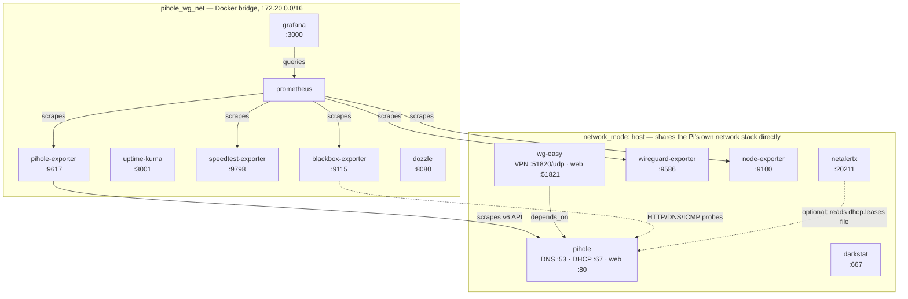
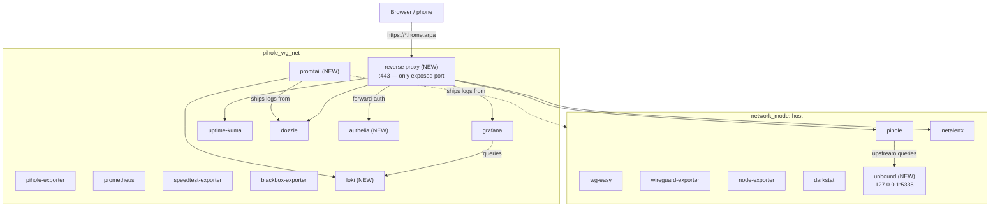

# pihole-wireguard: Additional Services to Close Remaining Gaps

**Status:** design proposal — not implemented. Written up from a conversation
about what's still missing from the stack, not coded yet.

## Problem

`pihole-wireguard` already covers DNS ad-blocking, VPN, metrics
(Prometheus/Grafana), uptime monitoring, bandwidth/traffic visibility
(darkstat), device discovery (NetAlertX), and live logs (Dozzle) — 13
services total. Three gaps remain even so:

1. **DNS privacy** — Pi-hole's upstream is whatever public resolver is
   configured (Cloudflare, Google, etc.), so DNS queries are still visible
   to a third party even after ad-blocking.
2. **No unified, authenticated front door** — every service sits on its own
   host port over plain HTTP, and two of them (Dozzle, NetAlertX) have no
   login at all by default — already documented as an accepted risk in
   `environments/pihole-wireguard/README.md` rather than actually closed.
3. **No log history** — Dozzle only shows live/ephemeral logs; nothing is
   retained or searchable once it scrolls past.

## Current Topology



`blackbox-exporter` also probes `grafana`, `uptime-kuma`, `wg-easy`,
`darkstat`, `google.com`, `github.com`, `1.1.1.1`, and `8.8.8.8` — omitted
from the diagram above as individual edges to keep it legible; see
`environments/pihole-wireguard/monitoring/blackbox/blackbox.yml` for the
full target list. `dozzle` also reads the Docker socket directly (not a
container-to-container edge) to list and stream logs from every container
on the host, in both subgraphs — also omitted for legibility.

Host-networked services can't be reached by container name from the bridge
network — that's why `pihole-exporter`, `prometheus`, `uptime-kuma`, and
`blackbox-exporter` all carry `extra_hosts: host.docker.internal:host-gateway`
and address `pihole`/`wireguard-exporter`/`node-exporter` via
`host.docker.internal:<port>` instead.

## Proposed additions

### 1. Unbound — local recursive DNS resolver

Replaces "whatever public resolver Pi-hole is configured to forward to"
with direct resolution from the root zone, removing the last third party
in the DNS path. Runs on `network_mode: host` (same as `pihole`), listening
on a loopback port (conventionally `127.0.0.1:5335`) that Pi-hole's
`FTLCONF_dns_upstreams` points at instead of a public resolver.

**Local hostname resolution is unaffected.** Unbound ships with RFC1918
reverse zones (`in-addr.arpa`) delegated to the AS112 project and set to
auto-NXDOMAIN by default — asking it "who is 192.168.1.50?" returns
nothing out of the box, same as any public resolver would. That's fine:
Pi-hole's own **Conditional Forwarding** setting (Settings → DNS) already
forwards LAN reverse lookups to the router directly, bypassing whatever
the general upstream is — that mechanism doesn't change just because the
upstream changes from a public resolver to Unbound. Don't try to make
Unbound itself resolve local hostnames; leave Conditional Forwarding
pointed at the router as it already is.

Unbound also runs DNS-rebinding protection by default (stripping private
IPs out of externally-sourced answers via its built-in `private-address`
list) — a security feature to keep, not a bug to work around.

### 2. Reverse proxy + auth gate (Caddy or Nginx Proxy Manager + Authelia)

Closes the "no login by default" gap for Dozzle and NetAlertX properly,
instead of leaving it as a documented caveat. Also collapses 8+ exposed
host ports down to one (443), and gives every service a real subdomain
instead of a port number to remember.

- **Proxy** terminates HTTPS once, forwards to each backend over the
  existing `pihole_wg_net` bridge using container names + *internal* ports
  (not the host-mapped ones) for anything already on that network, and
  `host.docker.internal` for the host-networked services (`pihole`,
  `wg-easy`, `darkstat`, `netalertx`) — same pattern already used by
  `pihole-exporter`/`blackbox-exporter`.
- **Authelia** (or `oauth2-proxy`) sits in front of the proxy as a
  forward-auth target — one login, one session, gates every backend
  uniformly rather than depending on each app's own (in two cases,
  nonexistent) auth.
- Once this is in place, backend host-port mappings (`GRAFANA_PORT`,
  `DOZZLE_PORT`, `NETALERTX_PORT`, etc.) can be dropped or rebound to
  `127.0.0.1` only — the proxy becomes the *only* way to reach any backend,
  even from the LAN.
- Pi-hole's **Local DNS Records** feature maps the chosen subdomains
  (`grafana.home.arpa`, `logs.home.arpa`, ...) to the Pi's own IP, so this
  needs no external DNS registration.

### 3. Loki + Promtail — log history and search

Dozzle only ever shows live, ephemeral output — nothing is retained past
what's currently in the container's log buffer, and there's no search.
Loki + Promtail adds retained, searchable, alertable log history, and fits
directly into the existing Grafana/Prometheus stack (same vendor, same
dashboards, no new mental model) rather than introducing an unrelated
logging product.

- `promtail` reads container logs the same way Dozzle does (Docker socket
  or `/var/lib/docker/containers`), ships them to `loki`.
- `loki` runs on `pihole_wg_net` like `prometheus`; Grafana adds it as a
  second datasource alongside the existing Prometheus one.
- Complements Dozzle rather than replacing it — Dozzle stays for
  "what's happening right now," Loki covers "what happened three days ago."

### Not recommended: Watchtower (auto-updating containers)

The repo's `CLEAN` policy already implements a deliberate pull-then-verify
update flow: pull fresh images *before* touching anything running, snapshot
the previous container as `<name>:clean-fallback` before removal, so a bad
image never leaves nothing running at all (see the root `README.md`'s
Policy Matrix and `pihole-wireguard/README.md`'s CLEAN-rollback section).
An auto-updater silently replacing containers on its own schedule works
against that safety net rather than complementing it — a bad upstream
image would get pulled and deployed with nobody watching, with no
rollback path prepared. If automatic updates are wanted later, they belong
*inside* this repo's own `CLEAN` mechanism (e.g. a cron calling
`REBUILD_POLICY=CLEAN ./run.sh` on a schedule), not a separate tool that
bypasses it.

## Proposed Topology (with additions)



## Sketch of what would change in this repo

Following the existing pattern of gating optional services behind their
own `.env` variables (see `NTOPNG_ENABLE` in the now-separate `ntopng`
environment, or `NETWORK_STATIC_IPS` in `run.sh`):

```bash
# .env.example additions
UNBOUND_ENABLE=false

REVERSE_PROXY_ENABLE=false
REVERSE_PROXY_DOMAIN=home.arpa    # base domain for subdomains, e.g. grafana.home.arpa
AUTHELIA_ENABLE=false             # only meaningful if REVERSE_PROXY_ENABLE=true

LOKI_ENABLE=false
```

- `docker-compose.yml`: new `unbound`, `caddy` (or `nginx-proxy-manager`),
  `authelia`, `loki`, `promtail` services, each conditionally deployed —
  mirrors the `ntopng`/`netalertx` addition pattern from earlier in this
  repo's history rather than introducing a new mechanism.
- `run.sh`: if `UNBOUND_ENABLE=true`, rewrite `FTLCONF_dns_upstreams` to
  point at `127.0.0.1:5335` instead of whatever's in `.env` — needs a clear
  precedence rule (Unbound wins over an explicit upstream if both are set,
  or refuse to start with both set, rather than silently picking one).
- `install-desktop.sh`: new entries for whichever of these get their own
  web UI (Authelia's login page, at minimum) — following the
  `run_desktop_install()` data-driven pattern already established in
  `lib/desktop-lib.sh`.
- `info.sh`: new data dirs (`unbound-data` isn't really needed — Unbound is
  mostly stateless config — but `loki-data`, `authelia-data`,
  `caddy-data`/certs would need the usual `DATA_DIRS` entries).
- `README.md`: Services & Ports table entries, plus a security note that
  once the reverse proxy is in place, backend `.env` ports become
  internal-only and shouldn't be relied on for direct LAN access anymore.

## Visualizing the current container topology

The diagrams above are accurate as of this doc's writing but static — they
won't update themselves as the stack changes. Two complementary options
for live visibility, discussed but not yet added:

- **[Portainer](https://www.portainer.io/)** — actively maintained, ARM64
  builds available, browser-based container/network/volume management.
  Doesn't draw a literal connection-graph diagram, but shows every running
  container, which Docker network(s) each belongs to, resource usage, logs,
  and gives start/stop/exec access beyond Dozzle's read-only view. The
  most practical general-purpose recommendation for "see what's actually
  running on this Pi" day to day.
- **[Dockge](https://github.com/louislam/dockge)** — lighter-weight,
  focused specifically on managing `docker-compose.yml` stacks (edit,
  redeploy, view logs per-stack) rather than full container management.
  Worth considering instead of Portainer if the goal is mainly "manage the
  compose files this repo generates," not general Docker administration.
- Neither replaces an actual network-topology diagram like the ones above
  — tools that did this well (Weave Scope) are no longer maintained. For
  now, the practical answer is: regenerate a diagram like this one by hand
  when the stack changes meaningfully, rather than relying on a live tool
  to draw it automatically.

## Open questions for whoever picks this up

- **Unbound + `FTLCONF_dns_upstreams` precedence.** Need to decide whether
  `UNBOUND_ENABLE=true` silently overrides any explicit
  `FTLCONF_dns_upstreams` value, refuses to start if both are set, or some
  other rule — silently overriding a value the user explicitly set feels
  like the wrong default.
- **Which reverse proxy.** Caddy has automatic HTTPS and a simpler config
  format; Nginx Proxy Manager has a web UI for managing proxy hosts/certs
  without editing config files by hand, which may suit this repo's
  TUI-driven, config-file-averse philosophy better. Not resolved here.
- **Authelia's own storage backend.** Authelia needs a user database and
  session store (SQLite is fine for a single-Pi setup, but confirm it
  doesn't need Redis/PostgreSQL for the scale here before committing to
  the simplest option).
- **Loki retention vs. SD card wear.** Unlike Prometheus's existing metrics
  retention (already a consideration in this stack), log volume from every
  container could grow quickly — needs an explicit retention policy
  (`table_manager` / `compactor` retention settings) from the start rather
  than discovering the SD card is full later.
- **None of this has been tested against real hardware** — same caveat as
  every other design doc in this directory; this was written up from a
  conversation, not built and verified.
