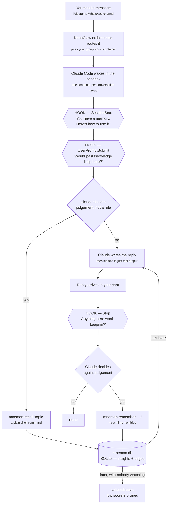
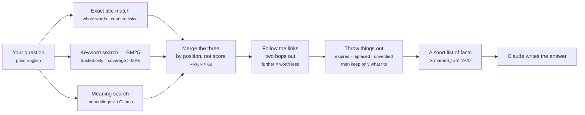
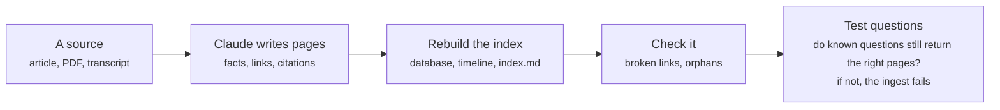

# How Remembering Works Here

A plain-language walkthrough of the two memory systems in play for this
environment: **mnemon**, which runs today, and the **OKF graph wiki**, which is
a design nobody has built. It follows a single message through each, end to
end, and translates the jargon at the bottom.

Written because the existing docs assume you already know what BM25, RRF and
reciprocal rank fusion are. This one doesn't.

> **Scope.** Mnemon's flow reflects the live install — hooks confirmed
> registered in a running container, decay constants and the importance mapping
> from mnemon's own design documents. The wiki flow is drawn from the OKF Graph
> Wiki gist and is **a design only**; nothing in it is built here, and adopting
> it would not replace mnemon. Analysis of that spec lives in
> [`docs/future-enhancements/okf-graph-wiki.md`](../../docs/future-enhancements/okf-graph-wiki.md);
> the component-by-component comparison is in [`GIST-PARITY.md`](./GIST-PARITY.md).

---

## The one-paragraph version

Two systems, built on opposite instincts.

**Mnemon** is a note-taker sitting beside the conversation. After each exchange
it asks whether anything was worth keeping, and if you never go back to a note,
it quietly fades until it is thrown away. That is deliberate: chat produces
enormous amounts of nearly-worthless detail, and a memory that keeps all of it
is a memory you cannot search.

**The OKF graph wiki** is a library. Every page is written on purpose, cited,
reviewed, and kept forever. Nothing fades. Instead of asking "is this still
worth keeping," it asks "given this question, which of my 632 pages are relevant
right now" — and answers with an index rather than a judgement call.

A note-taker and a library are both useful. They are not substitutes.

---

# Part one: a message through mnemon

**Status: running today.**

The single most useful thing to know before reading the diagram:
**mnemon contains no AI.** It is a small database program with a command line.
It never decides anything.

Every decision — should I look something up, is this worth remembering, what
exactly should I write down — is made by Claude, in the middle of its normal
turn. Mnemon's hooks do not *perform* memory operations. They **interrupt Claude
and ask a question**. Claude answers by choosing to run a command, or not.

The three hooks are the only places mnemon touches the conversation — and each
one asks a question rather than doing anything. The dashed path is what runs
when nobody is looking.

## The same thing in words

1. **Your message lands.** NanoClaw's orchestrator picks the container belonging
   to your conversation group and hands the message over.
2. **The `SessionStart` hook fires**, once per session. It does not load your
   memories. It tells Claude that a memory exists, which store it is, and where
   the instructions for using it live. Think of it as pointing at a filing
   cabinet, not opening it.
3. **The `UserPromptSubmit` hook fires**, on every message, before Claude starts
   working. This is the "Remind" phase: it asks whether prior knowledge might be
   relevant.
4. **Claude decides.** A judgement call, guided by the rules written into the
   group's `CLAUDE.local.md` — recall for anything touching an existing topic,
   person, decision or preference; skip it for a trivial follow-up on the same
   subject. See [`MNEMON-RECALL-POLICY.md`](./MNEMON-RECALL-POLICY.md).
5. **If yes, Claude runs a command.** Literally `mnemon recall "topic"` in a
   shell. Mnemon searches its database and prints text. That text lands in
   Claude's context exactly like the output of any other tool.
6. **Claude writes the reply** using that text plus the conversation. The reply
   is always Claude's. Mnemon never generates a word of it.
7. **The `Stop` hook fires** after the reply — the "Nudge" phase. It asks whether
   anything from this exchange is durable enough to write down.
8. **If yes, Claude runs `mnemon remember`**, choosing the wording, the category,
   and an importance from 1 to 5. Mnemon stores whatever string it is handed.
9. **Afterwards, quietly, things fade.**

A fourth hook, `PreCompact`, fires when the conversation grows too long to hold
and is about to be summarised. It asks Claude to save anything needed for
continuity before the raw transcript is discarded.

## What "fading" actually means

Every stored memory carries a base importance from 1 to 5, which mnemon converts
to a weight. Importance 3 — **the default when nobody specifies one** — becomes
0.5. That weight then halves every 30 days the memory goes untouched:

| Days since last recalled | Importance 3 (default) | Importance 4+ |
|---|---:|---:|
| 0 | 0.50 | 0.80 |
| 30 | 0.25 | 0.80 |
| 60 | 0.125 | 0.80 |
| 90 | 0.0625 | 0.80 |

Two things take a memory off that curve: an importance of 4 or 5, or being
recalled at least three times. Everything else eventually becomes a candidate
for deletion once the store passes a thousand memories, at which point each
pass soft-deletes the ten lowest scorers.

> **Why this matters right now.** In July, 83 wiki pages were bulk-loaded into
> mnemon — 321 memories, imported at the default importance. That import is
> roughly a month old, so those memories are now worth about half what they
> were, and are sliding toward the prune list. Nothing is broken; mnemon is
> doing exactly what it was built to do. Reference material was simply put in
> the one place designed to let go of things it isn't asked about — and the wiki
> has since grown from 83 pages to 632, so the copy covers about an eighth of
> what exists. Full account in
> [`docs/lessons-learned/nanoclaw-mnemon.md`](../../docs/lessons-learned/nanoclaw-mnemon.md).

**Sourcing note:** the hook names, decay formula and importance mapping come
from mnemon's own design docs and a live check of the running container. The
finer internals of its search — beam search, re-ranking — are reported in those
docs but were not independently verified against the source code here.

---

# Part two: a question through the graph wiki

**Status: a design. Nothing here is built.**

This answers a different question from mnemon's. Mnemon asks *"do I have a note
about this?"* The wiki asks *"of my 632 pages, which handful should Claude read
before answering?"* — because 632 pages will not fit in a conversation, and
reading the index has stopped working now that a third of the pages aren't
listed in it.

Retrieval runs in three moves: **find** some starting pages, **follow** the links
out of them, then **trim** to what fits.

Claude still writes the answer. This only chooses what it gets to read first.

## Why three searches instead of one

Each is blind in a way the others aren't.

- **Exact title match** is the cheapest and most certain: if you name a page,
  you want that page. It only fires when you say the title outright, and only on
  whole words — a page called "AI" must not match on the word "expl**ai**n", nor
  "Go" on "a**go**".
- **Keyword search** finds pages containing your words even if the title says
  nothing. It misses anything phrased differently — ask about "cars" and it will
  not find a page that only says "automobiles".
- **Meaning search** catches exactly that rephrasing, because it compares *sense*
  rather than spelling. It is also the vaguest, and the one most likely to
  return something plausible and wrong.

Run all three, then let them vote.

## The vote, worked through

Each search returns its own ranking. Nobody's scores are comparable, so only the
**positions** are used. Each appearance is worth `1 / (60 + rank)`:

| | Title (counts twice) | Keyword | Meaning |
|---|---|---|---|
| 1st | Page A | Page C | Page B |
| 2nd | Page C | Page A | Page A |
| 3rd | — | Page B | Page C |

Adding up:

| Page | Arithmetic | Total |
|---|---|---:|
| **A** | `2/61 + 1/62 + 1/62` | **0.0650** |
| **C** | `2/62 + 1/61 + 1/63` | 0.0645 |
| **B** | `1/63 + 1/61` | 0.0323 |

**Page B came first in one search — and lost.** It appeared in two lists; A and
C appeared in all three. Because 1st and 2nd place are worth almost the same
(0.0164 vs 0.0161), no single search can force a winner. Agreement beats
enthusiasm. That is the whole trick, and the `+ 60` is what does it.

## "BM25 gated on word coverage, not score"

The one genuinely clever idea in the spec, and worth unpacking properly.

**BM25 is a keyword relevance score.** Given a question and a page it produces a
number: higher means a better keyword match. It is the standard used by
essentially every search box, and it balances three things — how often your words
appear, how rare those words are (matching "Kampong" tells you far more than
matching "the"), and how long the page is, so a long document doesn't win just by
containing more words.

**The catch: that number means nothing on its own.** A BM25 score of 8 might be
an excellent match for one question and a poor one for another, because it
depends on which words you asked about and how common they are across all 632
pages. There is no threshold like "above 5 is good" that holds from one question
to the next.

So the spec ignores the score when deciding whether to *trust* the result, and
asks a different question: **of the meaningful words in your question, what
fraction actually appear in the page it found?** That is a plain ratio, and it
means the same thing every time.

Worked through — you ask *"when did Bernard marry?"*. Two words carry meaning:
`bernard` and `marry` ("when" and "did" appear on every page, so they tell you
nothing).

| Candidate page | Contains `bernard` | Contains `marry` | Coverage | Verdict |
|---|---|---|---:|---|
| `tan-family-tree.md` | ✓ | ✓ | 2/2 = 1.00 | trusted |
| `wedding-recipes.md` | ✗ | ✓ | 1/2 = 0.50 | **not** trusted |

The gate is *more than half*, so exactly 0.50 fails. Both pages might score well
on BM25 — the recipe page could even score **higher** if it says "marry" ten
times. Coverage doesn't care how *loudly* a page matches. It asks how *much* of
your question it accounts for.

## Getting knowledge in, as opposed to out

Everything above is the read path. Writing works differently — and unlike
mnemon, it is deliberate rather than a judgement call at the end of a chat.

The index, the timeline and `index.md` are all rebuilt from the pages every
time — never edited by hand — so they cannot drift out of date the way
`index.md` has today. The last box is the unusual one: a knowledge base with a
regression test, where adding a page that breaks existing answers is rejected
rather than merged.

---

# Side by side

| | Mnemon — today | Graph wiki — proposed |
|---|---|---|
| **What it is for** | Remembering the conversation | Finding things in a library |
| **What goes in** | Whatever Claude judges worth keeping, at the end of a turn | Pages written on purpose, from a source, with citations |
| **Who decides** | Claude, every time, by judgement | A pipeline, the same way every time |
| **Over time** | Fades, then is pruned | Nothing is ever dropped |
| **Where it lives** | One SQLite file per group | Markdown files you can read and diff |
| **Can you review it** | Only through the tool | Yes — it's text, in version control |
| **Status** | Running, with real data | Not built. No commitment to build it. |

The reason to keep both is in the first row. Asking a library to remember that
you prefer short replies is silly; asking a note-taker to hold 632 cited pages
forever is what has already gone wrong once.

---

# The jargon, plainly

**BM25** — A keyword relevance score, and the default in almost every search box
since the 1990s. It rewards a page for containing your words, weights rare words
far above common ones, and corrects for length so a long page doesn't win by
sheer bulk. Its output is a bare number that is only meaningful *relative to
other results for the same question*, which is why the coverage gate exists.

**Word coverage gate** — Instead of asking "is this BM25 score high enough" —
unanswerable, since the scale shifts per question — ask "what fraction of the
meaningful words in the question appear in this page". More than half, and the
keyword search is trusted. That ratio means the same thing for every question.

**RRF — reciprocal rank fusion** — A way of merging several ranked lists when
their scores can't be compared. Ignore the scores entirely and use position:
each appearance is worth `1 / (60 + rank)`, added up across lists. The `60`
makes first and second place nearly equal in value, so a page wins by appearing
in several lists rather than topping one. From a 2009 research paper; the
constant 60 is theirs.

**FTS5** — SQLite's built-in full-text search. It is what makes keyword search
over 632 pages instant instead of a file-by-file scan, and it works on the body
text of a page — no special formatting required.

**Embedding · vector · cosine similarity** — An embedding turns a piece of text
into a long list of numbers (a *vector*) positioned so that texts meaning similar
things end up near each other, regardless of the words used. *Cosine similarity*
measures that nearness, from 0 to 1. This is what lets a search for "cars" find a
page about "automobiles". It runs locally through Ollama using a model called
`nomic-embed-text`; nothing is sent anywhere.

**Intent detection** — A quick guess at what *kind* of question you asked — why,
when, who, or general — used to prefer different sorts of links when following
the graph. A "when" question leans on dated relationships; a "who" question
leans on people.

**Hop · two-hop expansion · hop decay** — Pages link to each other. A *hop* is one
step along such a link. Starting from the pages the search found, the pipeline
walks out two steps to pick up neighbours — your grandfather's page leads to his
wife's, which leads to her sister's. *Hop decay* means each step out counts for
less, so distant pages don't crowd out the ones you actually asked about.

**Trust tier** — Pages record whether a human checked them. Human-reviewed facts
score highest, machine-confirmed ones lower, unchecked ones lower still — so
provenance affects what surfaces, rather than just being displayed at the bottom
of a page.

**Supersession · staleness** — Two ways of handling facts that stop being true.
*Supersession* is when one page explicitly replaces another and searches follow
the chain to the current version. *Staleness* is an expiry date on a fact, after
which it stops being offered. Together they answer "the wiki contains two
contradictory statements and both are technically in there".

**Frontmatter** — The block at the very top of a markdown file, fenced by `---`,
holding structured fields rather than prose — title, type, tags, dates. It is how
a file carries information a program can read without understanding the writing
below it.

**Triple · predicate · object** — A fact broken into three parts: *subject*,
*predicate*, *object* — "Bernard *married* Jennie". In the wiki the subject is the
page itself, so only the other two are written down. A decades-old way of storing
facts so a program can follow them as links instead of reading sentences.

**Hook** — A script Claude Code runs at a fixed moment: when a session starts,
when you send a message, when a reply finishes. A hook cannot make Claude do
anything; it injects a note into the turn. Every mnemon behaviour described here
is a hook asking a question and Claude choosing how to answer it.

**Effective importance · half-life** — Mnemon's stored value for a memory: its
base importance, reduced by how long since it was last used. It halves every 30
days (the *half-life*), so a default-importance memory is worth half as much
after a month and a quarter after two — unless it was marked important or has
been recalled three times.

**Insight · edge** — Mnemon's two tables. An *insight* is one remembered thing. An
*edge* is a connection between two of them, and mnemon guesses these itself in
four flavours — causal, temporal, entity, semantic — rather than being told. That
guessing is why the July import produced 3,295 connections from 140 that were
actually written down.

**OKF — Open Knowledge Format** — A real published specification from Google
Cloud, June 2026, for storing knowledge as plain markdown files with structured
frontmatter so AI agents can navigate it. It requires very little — essentially
just a `type` on each file. The typed relationship triples discussed here are the
gist author's own addition on top of it, not part of the standard.
